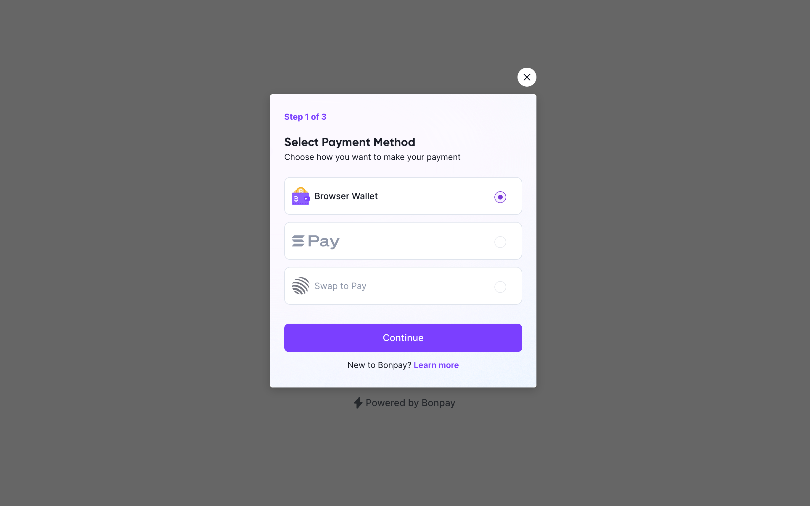

# bonpay-react



A React library that provides a customizable button component for integrating with the Bonpay payment system. This component allows you to easily create payment buttons with various payment methods and customization options.

## Installation

You can install `bonpay-react` using npm:

```bash
npm install bonpay-react
```

## Usage

1. Import the `BonpayButton` component and the necessary types from the library:

```jsx
import React from 'react';
import { BonpayButton, BonpayButtonProps } from 'bonpay-react';
```

2. Create your `onSuccess`, `onError`, and `onClose` callback functions:

```jsx
function onSuccess(data: any) {
  console.log(data);
}

function onError(error: any) {
  console.log(error);
}

function onClose(data: any) {
  console.log(data);
}
```

3. Configure the `BonpayButton` component by providing the necessary props:

```jsx
const config: BonpayButtonProps = {
  amount: '0.0001',
  recipient: '9rXsixbNgveNs6aUmzoQmiG3qsmhaTfra1Y3NarjCrxh',
  paymentSource: 'direct',
  network: 'MAINNET',
  blockchain: 'solana',
  paymentMethods: {
    solanaPay: true,
    browserWallet: true,
    swapToPay: true,
  },
  apiKey: 'bp_3d3d29876cvx82987eded3ewc2d2s2ed3d3d34',
  currency: 'USDC',
  paylinkId: 'm4pkcmCmv2iZfvS',
  onSuccess,
  onError,
  onClose,
  text: 'Pay Now',
};
```

4. Render the `BonpayButton` component with the provided configuration:

```jsx
const App = () => {
  return <BonpayButton {...config} />;
};

export default App;
```

## Props

- `amount` (string): The payment amount.
- `recipient` (string): The recipient's address.
- `paymentSource` (string): The payment source (`'paylink'` or `'direct'`).
- `network` (string): The network name.
- `blockchain` (string): The blockchain name.
- `paymentMethods` (object): An object indicating available payment methods.
- `apiKey` (string): The Bonpay API key.
- `currency` (string): The currency of the payment.
- `paylinkId` (string): The paylink ID.
- `onSuccess` (function): Callback function when payment is successful.
- `onError` (function): Callback function on payment error.
- `onClose` (function): Callback function when the payment modal is closed.
- `text` (string): The text for the button.

## License

This library is licensed under the MIT License.
